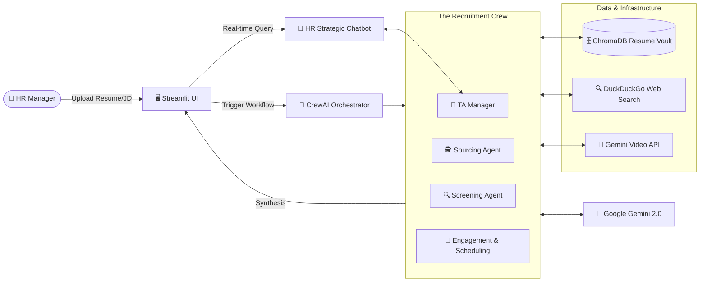

# 🏗️ TalentSpark AI: System Architecture

TalentSpark AI is a multi-agent recruitment intelligence platform built on a **Modular Agentic Architecture**. It leverages **CrewAI** for orchestration, **Google Gemini** for reasoning, and **ChromaDB** for persistent vector storage.

---

## 📊 High-Level Flow Diagram

---

## 🧱 Component Breakdown

### 1. **Frontend (Streamlit)**
- **Dashboard**: Multi-tab interface for Anonymization, Screening, Market Research, etc.
- **HR Assistant**: A real-time chat interface that preserves session state and analyzes current recruitment results.
- **File Processors**: Custom modules for handling PDF parsing and Video Byte-streams.

### 2. **Orchestration Layer (CrewAI)**
- **Process Type**: Sequential.
- **Context Sharing**: Each task passes its result as context to the next agent (e.g., the Screener providing context for the Engagement Specialist).
- **Agents**: 4 specialized personas (TA Manager, Sourcing, Screening, Candidate Experience).

### 3. **Intelligence Layer (Google GenAI)**
- **LLM**: Gemini 1.5 Pro and Gemini 1.5 Flash.
- **Embeddings**: `text-embedding-004` (768 dimensions) for semantic retrieval.
- **Multi-modal**: Google GenAI File API for analyzing MP4/MOV interview videos.

### 4. **Storage & Tools**
- **Vector DB**: ChromaDB (Local persistent storage in `./db/resume_vault`).
- **Web Tools**: DuckDuckGo API for real-time market benchmarking and external candidate sourcing.

---

## 🔄 Data Lifecycle
1. **Input**: HR Manager uploads a PDF Resume and a Markdown Job Description.
2. **Analysis**: The Crew runs a 9-step pipeline (Anonymize -> Screen -> Culture -> Market -> Source -> Engage -> Schedule).
3. **Storage**: Meritorious candidates are indexed into the ChromaDB Vault.
4. **Interaction**: The HR Manager uses the Chatbot to ask strategic questions about the generated intelligence.
